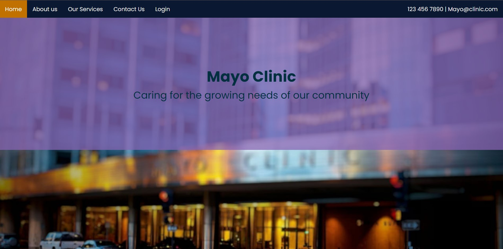
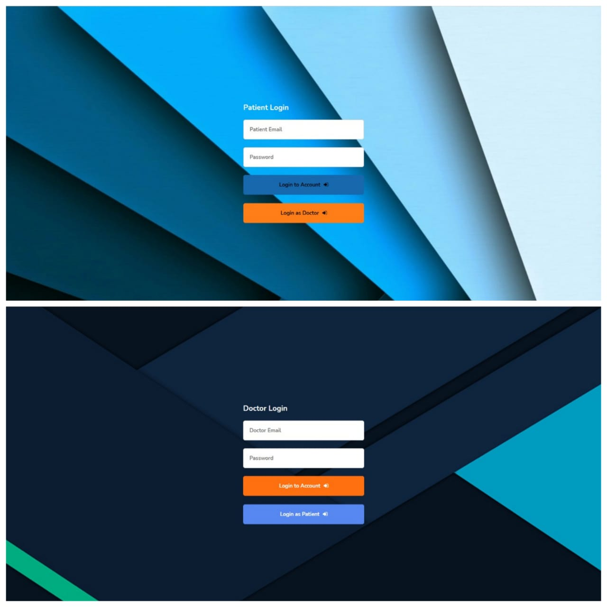
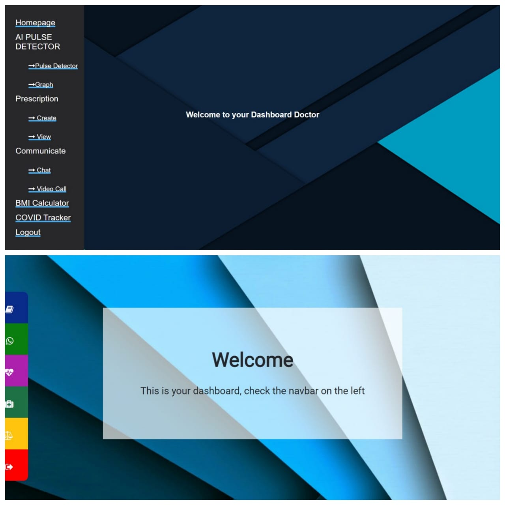
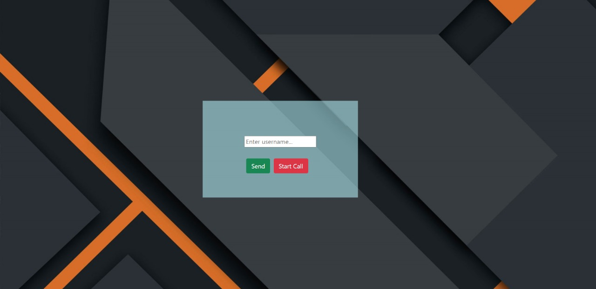

# Team - Paracetamol
## HealthCare
Project based on HealthCare.

## Mayo Clinic
Project build for TECHNOTHON 1.0

## College Name
SRM IST KTR

## Theme - HealthCare
Project based on HealthCare.

## Details of all Team Members
- Kevin T Jinu (SRM IST KTR)
- Adhith Sankar (SRM IST KTR)
- Keshav Rao (SRM IST KTR)
- Deepak Shrinivas (SRM IST KTR)

## Discord Usernames of TEAM MEMBERS
- Kevin Jinu | Participant
- Adhith Sankar | Participant
- Deepak Shrinivas | Participant
- Keshav Rao | Participant

## Tagline
<!-- Mayo Clinic is a web application that helps patients connect with their doctors easily over the internet. We provide various methods of communicating with their doctors using login credentials. -->

# Detailed Explanation of the Idea
During this pandemic, patients find it hard to visit hospitals and communicate with their doctors with ease. This is where Dolo-650 comes into play. It acts as a platform between a doctor and their patients. This application was mainly made for the patients who are currently home quarantined due to covid or due to any other pre-existing conditions. We have included features such as Video calling, a Chatting Platform, E- Prescription, BMI Calculator, and a COVID-19 Tracker as well.

# Solution
This is where Mayo Clinic comes into play. It acts as a platform between a doctor and their patients. This application was mainly made for the patients who are currently home quarantined due to covid or due to any other pre-existing conditions. 

## Tech Stack used 
- HTML
- CSS
- JavaScript
- Firebase Cloud Database
- Firebase Authentication
- Bootstrap
- WebSocket
- OpenCV-Python
- Flask

# Step by Step Procedure to run your respective Project in our Local Machine 

      Step 1 :
    
        Fork this repository or else use git clone, to clone the repository on your local machine
    
      Step 2 :
    
        Install the requirments.txt file 
    
      Step 3 :
    
        Open the code in any code editor (eg VsCode, Jupyter Notebook)
    
      Step 4 :
    
        Terminal 1:
        Run "node server.js" 

        Terminal 2:
        Run "python detector.py"

## Demo
Checkout the demo video from [here](https://youtu.be/kMC4UcKwrlU).

## PPT
[here](https://drive.google.com/file/d/1_gtecq73eBg-j7EYOndyVS28Q4nAWrjK/view?usp=sharing)

## Challenges we ran into
As this was actually our first hackathon, we ran into the problem of time management. We had a lot more planned for this project, such as AI pulse Rate Detector using Python Libraries and other features such as implementing graphs for the data generated over time. We ran into a bit of a problem while working with the firebase authentication which has since been resolved successfully. We believe we have a solid project on hand and we have done to the best of our abilities to get to this point. We hope you like our project.

## Future Updates
- We are planning to add a module for appointment booking
- We will be bringing a graphical representation of the BMI of a patient
- We will be implementing a diabetes tracker where the patient will keep a track of his diabetes level
- Indicating cancer with a  CT- Scan using AI and Machine learning
- Implementation of Eye Checking in the video call with doctor

## Some glimpse of the site
Homepage

Login

 
Doctor dashboard

Chat Options

