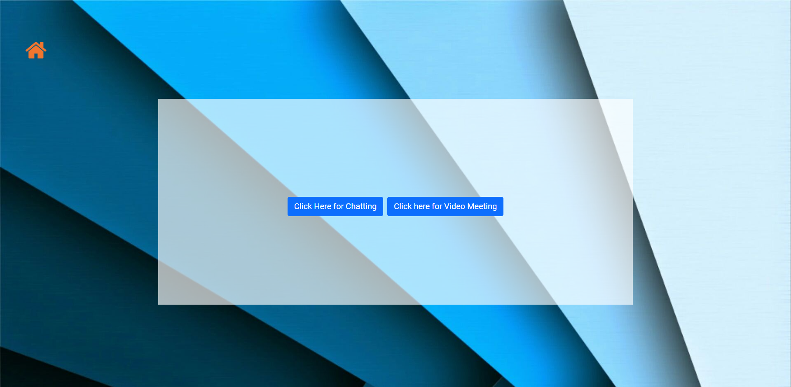

# DOLO-650
Project build for HACK THE MOUNTAINS 2.O

## Tagline
<!-- Dolo-650 is a web application that helps patients connect with their doctors easily over the internet. We provide various methods of communicating with their doctors using login credentials. -->

## Problem Statement:
<!-- During this pandemic, patients find it hard to visit hospitals and communicate with their doctors with ease. This is where Dolo-650 comes into play. It acts as a platform between a doctor and their patients. This application was mainly made for the patients who are currently home quarantined due to covid or due to any other pre-existing conditions. We have included features such as Video calling, a Chatting Platform, E- Prescription, BMI Calculator, and a COVID-19 Tracker as well.
 -->
## Demo
Checkout the demo video from [here](https://youtu.be/kMC4UcKwrlU).

## PPT
[here](https://drive.google.com/file/d/1is-QnCbRfYK0lkSyxZvEglxj9OFveGb4/view?usp=sharing)

## What Inspired
<!-- Patients find it hard to visit hospitals and communicate with their doctors with ease during this covid pandemic and patients often tend to lose their prescription forms after fews weeks. -->

## What it does

## How we built it
- HTML
- CSS
- JavaScript
- Firebase (Authentication and Chatting)
- Websocket (Video)

## Challenges we ran into
<!-- As this was actually our first hackathon, we ran into the problem of time management. We had a lot more planned for this project, such as AI pulse Rate Detector using Python Libraries and other features such as implementing graphs for the data generated over time. We ran into a bit of a problem while working with the firebase authentication which has since been resolved successfully. We believe we have a solid project on hand and we have done to the best of our abilities to get to this point. We hope you like our project. -->

## Accomplishments that we're proud of
<!-- As mentioned above, this was our first hackathon and hence building a project that is rather huge than the small programs we run on the daily, we have a sense of satisfaction. Also, we learnt firsthand on how a project is build and learnt where we can make changes to make the entire process more efficient. We are all glad and happy to be a part of this hackathon. -->

## What we learned
<!-- Firebase authentication, using advance Javascript. -->

## Future Updates
<!-- - To implement an AI module which detects Pulse and Heart rate by just looking into the camera 
- Plotting Graphs for the data set recieved -->

## Some glimpse of the site
Homepage

Login

 
Doctor dashboard

Chat Options

## HealthCare
Project based on HealthCare.
